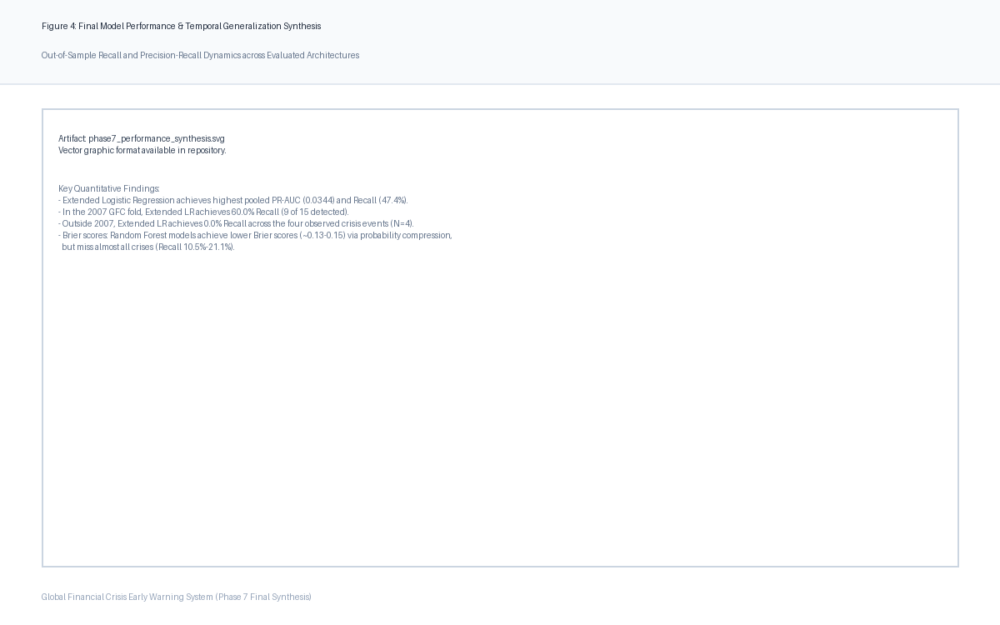

# Global Financial Crisis Early Warning System

> **Research Question:** Can macro-financial indicators provide useful early warning signals of systemic banking crises?

An independent quantitative macro-finance research project evaluating linear and machine-learning early warning systems (EWS) for systemic banking crises across an objective 76-country panel from 1990 to 2025.

The project implements a strictly leak-free expanding-window temporal validation design, compares parametric Logistic Regression against non-parametric Random Forest ensembles, and provides a methodologically transparent diagnosis of early warning capabilities, severe rare-event class imbalance, and the structural limits of cross-regime temporal generalization.

---

## Research Question

Systemic banking crises generate protracted contractions in output, employment, and fiscal stability. This project investigates:

1. **Balance-Sheet Information Content:** Does augmenting standard macroeconomic flow indicators (real GDP growth, inflation, international reserves) with balance-sheet leverage (private credit to GDP) and external imbalances (current account to GDP) improve out-of-sample crisis discrimination?
2. **Temporal & Regime Generalizability:** Is any observed predictive advantage of the extended specification temporally stable across historical epochs, or is it an empirical artifact of performance gains concentrated within a single macro-financial crisis cluster (specifically, the 2007–2008 Global Financial Crisis)?

---

## Why This Matters

Early warning systems for financial crises often suffer from two major methodological flaws in the applied machine learning literature:
- **Look-Ahead Leakage:** Standard randomized $k$-fold cross-validation or whole-sample preprocessing allows future crisis volatility and post-crisis macroeconomic fallout to contaminate past training sets, creating an illusion of high predictive accuracy that fails in prospective real-time testing.
- **The Fallacy of Pooled Metrics:** Aggregate pooled out-of-sample metrics can disguise complete non-generalizability when positive events cluster in a single historical shock wave, leading researchers to mistake episode-specific vulnerability detection for a universal early warning signal.

This project addresses these challenges by enforcing a strict expanding-window temporal validation protocol with train-only preprocessing, cost-sensitive rare-event weighting, and granular fold-by-fold failure diagnostics.

---

## Data

The empirical analysis relies strictly on authoritative, official multilateral sources:

- **World Bank World Development Indicators (WDI):** Annual panel of macroeconomic and financial indicators covering 1990–2025 across 76 economies ($N = 2,736$ country-years).
- **IMF Systemic Banking Crises Database (Laeven & Valencia, 2026, IMF WP/26/94):** The authoritative academic ground truth for non-borderline systemic banking crisis dates, requiring significant financial distress and substantial public policy intervention measures.

### Country Universe
An objective, balanced panel of **76 World Bank member economies** spanning 28 advanced economies and 48 emerging and developing economies with continuous historical coverage from 1990 through 2025.

---

## Methodology

- **Supervised Target:** One-year-ahead forward crisis onset ($y_{c,t} = 1$ if a systemic crisis begins in country $c$ at calendar year $t+1$; $0$ otherwise). Predictors are measured strictly at year $t$, eliminating contemporaneous information leakage.
- **Validation Architecture:** Nine sequential expanding-window temporal test folds ($T = 2000, \dots, 2008$). Models train strictly on historical data $[1990, T-1]$ and generate out-of-sample predictions on test fold $T$ across all 76 countries ($N = 684$ evaluated out-of-sample country-years, containing 19 forward crisis onsets).
- **Leak-Free Preprocessing:** Missing-value median imputation and z-score feature standardization are fitted strictly on training partition $[1990, T-1]$ and applied forward to test year $T$.
- **Model Classes:**
  - *Baseline Logistic Regression (4 variables):* Macroeconomic flows (`gdp_growth`, `inflation`, `reserves_usd`, `reserves_usd_yoy_pct_change`).
  - *Extended Logistic Regression (6 variables):* Adds banking leverage (`private_credit_pct_gdp`) and external financing balance (`current_account_pct_gdp`).
  - *Baseline & Extended Random Forests (100 balanced bootstrap trees, depth $d=4$):* Non-linear benchmark comparators.
- **Rare-Event Handling:** Cost-sensitive class weighting inversely proportional to training frequencies, combined with multi-metric evaluation focusing on Precision-Recall Area Under the Curve (PR-AUC), ROC-AUC, Recall, Precision, and Brier calibration scores.

---

## Key Findings

Across 684 pooled out-of-sample evaluations ($N_{\text{crisis}} = 19$, unconditional prevalence = $2.78\%$), the pre-registered architectures yielded the following locked results:

| Model Architecture | Predictors | Pooled PR-AUC | Pooled ROC-AUC | Recall ($\tau=0.50$) | Precision ($\tau=0.50$) | Brier Score | False Alarms (FP) |
| :--- | :---: | :---: | :---: | :---: | :---: | :---: | :---: |
| **Baseline Logistic Regression** | 4 flows | 0.0278 | 0.5106 | 21.05% ($4/19$) | 1.89% ($4/212$) | 0.2512 | 208 |
| **Baseline Random Forest** | 4 flows | 0.0256 | 0.4712 | 21.05% ($4/19$) | 2.42% ($4/165$) | 0.1524 | 161 |
| **Extended Logistic Regression** | **6 vars** | **0.0344** | **0.5734** | **47.37%** ($9/19$) | **4.59%** ($9/196$) | 0.2482 | 187 |
| **Extended Random Forest** | 6 vars | 0.0274 | 0.4715 | 10.53% ($2/19$) | 1.61% ($2/124$) | **0.1347** | **122** |

### Temporal Breakdown of Extended Logistic Regression

| Temporal Slice | Scope | Folds | Observations | Crises ($N_{\text{pos}}$) | PR-AUC | ROC-AUC | Recall ($\tau=0.50$) | Precision |
| :--- | :--- | :---: | :---: | :---: | :---: | :---: | :---: | :---: |
| **Pooled Out-of-Sample** | All Test Years (2000–2008) | 9 | 684 | 19 | **0.0344** | **0.5734** | **47.37%** ($9/19$) | 4.59% |
| **2007 Pre-GFC Fold** | Test Year 2007 ($t \to 2008$) | 1 | 76 | 15 | **0.2647** | **0.6470** | **60.00%** ($9/15$) | **31.03%** |
| **Excluding 2007 Fold** | Folds 2000–2006, 2008 | 8 | 608 | 4 | **0.0051** | **0.2301** | **0.00%** ($0/4$) | **0.00%** |



---

## Main Result

> **"The observed predictive advantage of the extended specification is concentrated in the 2007 pre-GFC evaluation fold and appears to reflect a particular macro-financial configuration rather than a broadly generalizable crisis signal."**

---

## Why the Result Is Interesting

The central contribution of this research is not simply claiming that a model "predicted the financial crisis." Rather, it provides an intellectually honest, mathematically rigorous demonstration of three crucial macro-financial realities:

1. **Balance-Sheet Expansion Adds Genuine Historical Information:** Adding private credit depth and current account balances more than doubled out-of-sample recall (from 21.05% to 47.37%) and improved PR-AUC by +23.7% over a flow-only baseline, successfully detecting pre-GFC vulnerabilities in Spain, Ireland, Iceland, Greece, and Portugal.
2. **The Predictive Advantage Is Regime-Dependent:** In the 2007 fold, where 15 of the 19 pooled crisis events clustered (78.9%), the extended model detected 9 of 15 crises (60.0% Recall). However, outside 2007, the model caught **0 of 4 crises** (0.0% Recall) and experienced an observed ranking inversion (ROC-AUC = 0.2301). The model identifies credit-boom and external-deficit archetypes, but cannot generalize to idiosyncratic or sovereign shocks (Uruguay 2002, Dominican Republic 2003, United Kingdom 2007, Nigeria 2009).
3. **Linear Models Outperform Tree Ensembles Under Rare-Event Imbalance:** While Random Forests achieve lower squared error (Brier score = 0.1347), they do so via extreme probability compression toward the 2.78% base rate, missing 17 of 19 crisis events. Linear logistic regression with cost-sensitive loss weighting permits risk probabilities to expand during credit expansions, providing actionable early warning signals.

---

## Repository Structure

```text
├── config/                  # Immutable experiment and profile specifications
│   ├── expanded_research.yaml   # 76-country panel configuration (Phases 4–7)
│   ├── variables.yaml           # WDI indicator definitions and transformation rules
│   └── countries.yaml           # ISO-3 country definitions
├── data/
│   ├── raw/                 # Versioned WDI downloads and IMF WP/26/94 extracts
│   ├── interim/             # Standardized panel extracts
│   └── processed/           # Modeling panels with forward target labels
├── docs/                    # Research documentation and academic paper
│   ├── RESEARCH_PAPER.md        # 11,966-word comprehensive academic research paper
│   ├── PROJECT_OVERVIEW.md      # Admissions & executive project walkthrough
│   ├── RESEARCH_LESSONS.md      # Methodological lessons learned
│   ├── INTERVIEW_PREPARATION.md # Technical Q&A across economics, stats, and ML
│   ├── PROJECT_CV_ENTRY.md      # Application and resume project descriptions
│   └── research_log.md          # Chronological 8-phase research audit trail
├── results/
│   ├── figures/             # Publication SVG and PNG performance visualizations
│   └── tables/              # Versioned out-of-sample metrics and coefficient tables
├── src/crisis_ews/          # Modular Python scientific package
│   ├── data/                # WDI API client and panel builders
│   ├── evaluation/          # Expanding-window validation, metrics, synthesis
│   ├── features/            # Preprocessing and leak-free transformations
│   ├── labels/              # Forward target construction and IMF database parser
│   └── models/              # Cost-sensitive logistic regression & random forests
├── tests/                   # 80 automated unit and integration tests (pytest)
└── pyproject.toml           # Standardized Python package configuration
```

---

## Reproducibility

The repository is fully reproducible from source code using standard Python tooling.

```bash
# 1. Clone repository and enter workspace
git clone https://github.com/ege211/global-financial-crisis-ews.git
cd global-financial-crisis-ews

# 2. Create virtual environment and install dependencies
python3 -m venv .venv
source .venv/bin/activate
pip install -e '.[dev]'

# 3. Execute full research synthesis pipeline (Phases 5–7)
python -m crisis_ews.cli run-final-synthesis

# 4. Execute automated test suite (80 passed tests)
pytest -v

# 5. Verify code quality and formatting
ruff check .
```

---

## Research Paper

For the complete 11,966-word academic research paper detailing the econometric derivation, literature context, three-layer mechanism architecture, parameter estimates, and exhaustive appendices, see:

📄 **[`docs/RESEARCH_PAPER.md`](docs/RESEARCH_PAPER.md)**

Additional portfolio walkthroughs:
- **[`docs/PROJECT_OVERVIEW.md`](docs/PROJECT_OVERVIEW.md):** 2-page research journey and intellectual motivation.
- **[`docs/RESEARCH_LESSONS.md`](docs/RESEARCH_LESSONS.md):** Methodological takeaways on validation, class imbalance, and negative results.
- **[`docs/INTERVIEW_PREPARATION.md`](docs/INTERVIEW_PREPARATION.md):** In-depth technical interview defense across economics, statistics, and machine learning.
- **[`docs/PROJECT_CV_ENTRY.md`](docs/PROJECT_CV_ENTRY.md):** Concise CV and application descriptions.

---

## Limitations

1. **Rare-Event Small Sample:** The evaluation sample contains only 19 crisis events across nine years, with only 4 events outside 2007.
2. **Historical Cutoff:** Evaluation terminates at 2008; post-2010 panel contains zero positive holdout events in this sample.
3. **Data Revisions:** Uses revised historical World Bank data rather than real-time publication vintages.
4. **Omission of Interbank Wholesale Data:** Macro aggregates cannot capture off-balance-sheet vehicles or cross-border interbank contagion (e.g., German/Swiss bank exposures to US subprime).
5. **Annual Granularity:** Cannot capture rapid intra-year liquidity freezes unfolding over days or weeks.
6. **False Alarm Burden:** At $\tau = 0.50$, the primary model generates 187 false alarms (precision 4.59%), carrying substantial policy costs.
7. **Observational / Non-Causal:** Parameters reflect historical associations, not structural policy multipliers.
8. **Research Baseline:** The framework is an empirical research baseline, not an operational central bank surveillance system.

---

## License

This project is licensed under the [MIT License](LICENSE).
